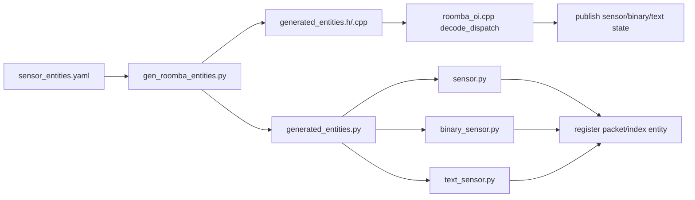

# Unify Roomba entities via generated manifest

## Goal

Replace `PacketDef/PACKETS` + per-platform Python maps with one declarative entity catalog that defines packet id, index, entity type, decoding behavior, and Home Assistant metadata; generate all runtime + schema code from it.
In parallel, introduce protocol-level opcode metadata from a separate manifest, but keep initial opcode scope limited to generated enum/constants/docs.

## Current duplication to remove

- C++ packet decode table in `[/home/retsamedoc/src/esphome-roomba-oi/components/roomba_oi/roomba_protocol.h](/home/retsamedoc/src/esphome-roomba-oi/components/roomba_oi/roomba_protocol.h)` only knows packet-level decode callbacks.
- Python metadata repeated in `[/home/retsamedoc/src/esphome-roomba-oi/components/roomba_oi/sensor.py](/home/retsamedoc/src/esphome-roomba-oi/components/roomba_oi/sensor.py)`, `[/home/retsamedoc/src/esphome-roomba-oi/components/roomba_oi/binary_sensor.py](/home/retsamedoc/src/esphome-roomba-oi/components/roomba_oi/binary_sensor.py)`, and `[/home/retsamedoc/src/esphome-roomba-oi/components/roomba_oi/text_sensor.py](/home/retsamedoc/src/esphome-roomba-oi/components/roomba_oi/text_sensor.py)`.
- Root codegen in `[/home/retsamedoc/src/esphome-roomba-oi/components/roomba_oi/__init__.py](/home/retsamedoc/src/esphome-roomba-oi/components/roomba_oi/__init__.py)` recomputes limits from those duplicated maps.

## Current repo state (verification)

- `protocol/roomba/sensor_entities.yaml`, `protocol/roomba/opcodes.yaml`, and `script/gen_roomba_entities.py` are **not present yet**; the plan remains the target architecture.
- MkDocs content for Roomba lives under `[/home/retsamedoc/src/esphome-roomba-oi/docs/components/roomba/](/home/retsamedoc/src/esphome-roomba-oi/docs/components/roomba/)` (see `[/home/retsamedoc/src/esphome-roomba-oi/mkdocs.yaml](/home/retsamedoc/src/esphome-roomba-oi/mkdocs.yaml)` nav: **Components → Roomba OI**). Generated/edited doc paths must use that prefix, not a flat `docs/*.md` root (except site `docs/index.md`).
- `[/home/retsamedoc/src/esphome-roomba-oi/components/roomba_oi/__init__.py](/home/retsamedoc/src/esphome-roomba-oi/components/roomba_oi/__init__.py)` now registers automation actions beyond `set_day_time`: `roomba_oi.start_clean`, `roomba_oi.dock`, `roomba_oi.stop`, `roomba_oi.reset`. When authoring `opcodes.yaml` and generated opcode docs, align names/codes with `[/home/retsamedoc/src/esphome-roomba-oi/components/roomba_oi/roomba_protocol.h](/home/retsamedoc/src/esphome-roomba-oi/components/roomba_oi/roomba_protocol.h)` `Opcode` and these actions.
- `[/home/retsamedoc/src/esphome-roomba-oi/.github/workflows/quality.yaml](/home/retsamedoc/src/esphome-roomba-oi/.github/workflows/quality.yaml)` currently triggers on `components/`** only; once manifests and generators land, extend path filters (or add a dedicated workflow) for `protocol/`**, `script/**`, and generated doc paths under `docs/components/roomba/`.
- `[/home/retsamedoc/src/esphome-roomba-oi/.github/workflows/docs.yaml](/home/retsamedoc/src/esphome-roomba-oi/.github/workflows/docs.yaml)` already watches `docs/**`, `components/**`, and `mkdocs.yaml`. Consider adding `protocol/**` and `script/**` to its `paths` so manifest or generator-only changes still trigger a docs build when generated pages are updated in the same workflow.

## Target design

- Add canonical sensor-entity manifest at `protocol/roomba/sensor_entities.yaml` as a top-level entity map (no `version`, no `entities` wrapper):
  - identity: implicit entity key from top-level YAML key, with either:
    - packet-backed fields: `packet_id`, optional `index` (defaults to `0`), `data_bytes`, `series_mask`
    - derived fields: no `packet_id`, but a required `transform` block with named `inputs` referencing other entity keys
  - kind: `sensor|binary|text`
  - flattened decode fields: `data_type` (`bool|u8|u16|s16`) and optional inline `enum`
  - transform fields live under `transform` (`name`, `inputs`, optional transform-specific params)
  - optional docs field: `description` (human-readable description used by generated docs)
  - metadata fields are flattened at entity level (`device_class`, `state_class`, `unit_of_measurement`, `icon`, `entity_category`, etc.)
- Generator defaults/inference:
  - if `index` is omitted, default to `0`
  - if inline `enum` exists on a `text` entity, decode as enum text from u8 value
  - for `type: binary`, infer bool bit decode automatically from `index` (bit-position mapping)
  - for `type: sensor`, `data_type` is required and must be one of `u8|u16|s16`
  - if `transform.inputs` references entity keys, dependency graph is derived automatically
  - explicit `dependencies` are optional and generally unnecessary when inputs are declared
- Add generator script (e.g. `script/gen_roomba_entities.py`) that emits:
  - generated C++ definitions (`EntityDef`, `ENTITIES`, packet-size/decode mapping helpers)
  - generated Python catalogs used by `sensor.py`, `binary_sensor.py`, `text_sensor.py`
- Add separate opcode manifest at `protocol/roomba/opcodes.yaml` as protocol source of truth for command IDs and basic metadata.
- Keep protocol source manifests outside runtime component directories to clarify they are codegen inputs, not runtime-loaded files.
- Keep handwritten logic only where behavior is truly custom (e.g. charge/capacity-derived battery percent).

### Example `sensor_entities.yaml` (mixed entity types)

```yaml
distance:
  description: Signed travel distance since last update, converted from mm to meters.
  packet_id: 19
  data_bytes: 2
  data_type: s16
  series_mask: [500, 600, 700, 900]
  type: sensor
  device_class: distance
  state_class: measurement
  unit_of_measurement: m
  icon: mdi:map-marker-distance
  transform: mm_to_m

voltage:
  description: Battery pack voltage converted from millivolts to volts.
  packet_id: 22
  data_bytes: 2
  data_type: u16
  series_mask: [500, 600, 700, 900]
  type: sensor
  device_class: voltage
  state_class: measurement
  unit_of_measurement: V
  transform: mv_to_v

bump_left:
  description: Left bump sensor bit from packet 7.
  packet_id: 7
  index: 1
  data_bytes: 1
  series_mask: [500, 600, 700, 900]
  type: binary
  device_class: problem

cliff_right:
  description: Right cliff detection status from packet 12.
  packet_id: 12
  index: 0
  data_bytes: 1
  series_mask: [500, 600, 700, 900]
  type: binary
  device_class: problem

charging_state:
  description: Human-readable charging state reported by the robot.
  packet_id: 21
  data_bytes: 1
  series_mask: [500, 600, 700, 900]
  type: text
  icon: mdi:battery-charging
  enum:
    0: Not Charging
    1: Reconditioning
    2: Full Charging
    3: Trickle Charging
    4: Waiting
    5: Charging Fault

oi_mode:
  description: Current Open Interface mode as text.
  packet_id: 35
  data_bytes: 1
  series_mask: [500, 600, 700, 900]
  type: text
  icon: mdi:robot-vacuum
  enum:
    0: Off
    1: Passive
    2: Safe
    3: Full

battery:
  description: Derived battery percentage from charge and capacity raw packets.
  data_type: u8
  series_mask: [500, 600, 700, 900]
  type: sensor
  device_class: battery
  state_class: measurement
  unit_of_measurement: "%"
  transform:
    name: ratio_percent
    inputs:
      numerator: charge_raw
      denominator: capacity_raw

charge_raw:
  description: Raw battery charge (mAh), internal source for derived battery percent.
  packet_id: 25
  data_bytes: 2
  data_type: u16
  series_mask: [500, 600, 700, 900]
  type: sensor
  internal: true

capacity_raw:
  description: Raw battery capacity (mAh), internal source for derived battery percent.
  packet_id: 26
  data_bytes: 2
  data_type: u16
  series_mask: [500, 600, 700, 900]
  type: sensor
  internal: true
```

This sample is intentionally small but includes scalar decode, binary auto-inference (no decode block), inferred enum decode (inline enum), and one packet-less derived sensor whose dependencies are inferred from transform inputs.

### Example `opcodes.yaml`

```yaml
start:
  code: 128
  description: Put the robot in Passive mode and enable OI commands.
  series_mask: [500, 600, 700, 900]

safe:
  code: 131
  description: Enter Safe mode.
  series_mask: [500, 600, 700, 900]

full:
  code: 132
  description: Enter Full mode.
  series_mask: [500, 600, 700, 900]

clean:
  code: 135
  description: Start a standard cleaning cycle.
  series_mask: [500, 600, 700, 900]

seek_dock:
  code: 143
  description: Send robot to dock.
  series_mask: [500, 600, 700, 900]

stream:
  code: 148
  description: Start sensor stream for listed packet IDs.
  series_mask: [500, 600, 700, 900]
  args:
    packet_count:
      data_type: u8
    packet_ids:
      data_type: u8_array
      length_from: packet_count

sensors:
  code: 142
  description: Request one sensor packet immediately.
  series_mask: [500, 600, 700, 900]
  args:
    packet_id:
      data_type: u8

set_day_time:
  code: 168
  description: Set day/hour/minute on robot clock.
  series_mask: [600, 700, 900]
  args:
    day:
      data_type: u8
    hour:
      data_type: u8
    minute:
      data_type: u8
```

This opcode sample demonstrates top-level implicit opcode keys, numeric opcode values, per-opcode descriptions, optional argument metadata, and per-series support masks.

Opcode argument conventions (aligned with entities):

- use `data_type` for argument typing (instead of `type`)
- prefer implicit argument names via arg-map keys; no `name` field required in normal cases
- keep explicit arg `name` support only as an escape hatch when needed for backwards compatibility

## Unified execution phases

1. Design and author both source manifests from current implementation:
  - `protocol/roomba/sensor_entities.yaml` from existing packet decode + Python entity metadata.
  - `protocol/roomba/opcodes.yaml` from current opcode enum/constants and usage docs.
2. Implement generator and generated outputs:
  - generate C++ entities/opcodes headers (+ sources as needed), Python catalogs, and docs under `docs/components/roomba/` (e.g. `sensors.md` sections, `opcodes.md`, workflow page).
  - ensure generator is deterministic and idempotent.
3. Wire generated outputs into runtime/codegen:
  - switch C++ entity/protocol lookups to generated tables.
  - switch Python schema registration to generated catalogs.
  - keep opcode runtime behavior unchanged in this phase (metadata/docs/constants generation only).
4. Validate and cut over:
  - run compile/schema/runtime parity checks, including derived-entity ordering and docs freshness checks.
  - remove `PacketDef/PACKETS` and legacy Python maps after parity is confirmed.
5. Deferred follow-up (post-cutover):
  - optional opcode argument schema/validation generation and action binding generation.

## Runtime/data flow after migration




## File-level implementation plan

- Add manifest and schema validation:
  - `[/home/retsamedoc/src/esphome-roomba-oi/protocol/roomba/sensor_entities.yaml](/home/retsamedoc/src/esphome-roomba-oi/protocol/roomba/sensor_entities.yaml)`
  - `[/home/retsamedoc/src/esphome-roomba-oi/protocol/roomba/opcodes.yaml](/home/retsamedoc/src/esphome-roomba-oi/protocol/roomba/opcodes.yaml)`
  - `[/home/retsamedoc/src/esphome-roomba-oi/script/gen_roomba_entities.py](/home/retsamedoc/src/esphome-roomba-oi/script/gen_roomba_entities.py)`
  - generator also updates/regenerates the entity table section of `[/home/retsamedoc/src/esphome-roomba-oi/docs/components/roomba/sensors.md](/home/retsamedoc/src/esphome-roomba-oi/docs/components/roomba/sensors.md)` from manifest data (optional marker-based injection for a handwritten intro)
- Add workflow/design documentation:
  - `[/home/retsamedoc/src/esphome-roomba-oi/docs/components/roomba/entities-manifest-workflow.md](/home/retsamedoc/src/esphome-roomba-oi/docs/components/roomba/entities-manifest-workflow.md)`
  - add nav entries under **Components → Roomba OI** in `[/home/retsamedoc/src/esphome-roomba-oi/mkdocs.yaml](/home/retsamedoc/src/esphome-roomba-oi/mkdocs.yaml)`
- Introduce generated C++ surface:
  - `[/home/retsamedoc/src/esphome-roomba-oi/components/roomba_oi/roomba_entities.generated.h](/home/retsamedoc/src/esphome-roomba-oi/components/roomba_oi/roomba_entities.generated.h)`
  - `[/home/retsamedoc/src/esphome-roomba-oi/components/roomba_oi/roomba_entities.generated.cpp](/home/retsamedoc/src/esphome-roomba-oi/components/roomba_oi/roomba_entities.generated.cpp)`
  - `[/home/retsamedoc/src/esphome-roomba-oi/components/roomba_oi/roomba_opcodes.generated.h](/home/retsamedoc/src/esphome-roomba-oi/components/roomba_oi/roomba_opcodes.generated.h)`
- Refactor runtime to consume generated entities:
  - `[/home/retsamedoc/src/esphome-roomba-oi/components/roomba_oi/roomba_protocol.h](/home/retsamedoc/src/esphome-roomba-oi/components/roomba_oi/roomba_protocol.h)`
  - `[/home/retsamedoc/src/esphome-roomba-oi/components/roomba_oi/roomba_oi.cpp](/home/retsamedoc/src/esphome-roomba-oi/components/roomba_oi/roomba_oi.cpp)`
  - `[/home/retsamedoc/src/esphome-roomba-oi/components/roomba_oi/roomba_decode.cpp](/home/retsamedoc/src/esphome-roomba-oi/components/roomba_oi/roomba_decode.cpp)`
- Refactor Python schemas/registration to generated catalogs:
  - `[/home/retsamedoc/src/esphome-roomba-oi/components/roomba_oi/sensor.py](/home/retsamedoc/src/esphome-roomba-oi/components/roomba_oi/sensor.py)`
  - `[/home/retsamedoc/src/esphome-roomba-oi/components/roomba_oi/binary_sensor.py](/home/retsamedoc/src/esphome-roomba-oi/components/roomba_oi/binary_sensor.py)`
  - `[/home/retsamedoc/src/esphome-roomba-oi/components/roomba_oi/text_sensor.py](/home/retsamedoc/src/esphome-roomba-oi/components/roomba_oi/text_sensor.py)`
  - `[/home/retsamedoc/src/esphome-roomba-oi/components/roomba_oi/__init__.py](/home/retsamedoc/src/esphome-roomba-oi/components/roomba_oi/__init__.py)`

## Validation gates

- Generator idempotence: running generator with no manifest changes yields no diff.
- Generated-docs freshness: `docs/components/roomba/sensors.md` (and other generated Roomba pages) match manifest output; stale generated sections fail CI or local check.
- Generated-opcode parity: generated opcode enum/constants match `protocol/roomba/opcodes.yaml` with no manual edits.
- C++ compile: generated `EntityDef/ENTITIES` are referenced everywhere `PACKETS` used today.
- ESPHome schema parity: all currently supported YAML keys still validate and register.
- Runtime parity smoke checks: representative sensor, binary, and text entities publish expected values.
- Edge case: battery percent still computed from packet 25 + 26 dependency with generated dependency metadata.
- Derived-entity check: packet-less transforms resolve input entities and dependency ordering without explicit dependency lists.
- Docs check: new workflow document is linked in docs nav and includes schema rules, full example manifest, runtime flow, and generator invocation examples.

## Documentation deliverable details

Create `docs/components/roomba/entities-manifest-workflow.md` with these sections:

- Background and motivation
  - why `PacketDef/PACKETS` + Python maps caused duplication
  - why manifest-driven generation is the new source of truth
- Manifest design (detailed)
  - entity shapes: packet-backed vs derived
  - required vs optional fields
  - type system (`sensor|binary|text`) and `data_type` rules
  - inference rules and precedence rules (binary decode inference, enum behavior, index defaulting)
  - transform contract (`transform.name`, `transform.inputs`) and dependency derivation
- Design rules (normative checklist)
  - strict rules for maintainers to follow when adding/changing entities
- Full example manifest
  - include the mixed packet-backed + derived example from plan
- Runtime flow
  - how packet bytes become values, then entity state publishes
  - how derived entities are recomputed from transform input dependencies
- Tool usage
  - exact command(s) to run codegen
  - where generated outputs are written
  - expected developer workflow (edit manifest -> run generator -> review diff -> test)
  - generated docs behavior for `docs/components/roomba/sensors.md` (handwritten intro + generated section strategy)
  - opcode workflow (`protocol/roomba/opcodes.yaml` -> generated opcode header/docs)
  - manifest locations (`protocol/roomba/sensor_entities.yaml` and `protocol/roomba/opcodes.yaml`)
- Add a companion protocol page for opcodes:
  - `[/home/retsamedoc/src/esphome-roomba-oi/docs/components/roomba/opcodes.md](/home/retsamedoc/src/esphome-roomba-oi/docs/components/roomba/opcodes.md)` generated from `protocol/roomba/opcodes.yaml`

## Manifest authoring additions

- Add optional `description` field on each entity in manifest:
  - primary purpose: generate human-readable docs (`docs/components/roomba/sensors.md`) without duplicating technical metadata
  - not required for runtime decode/codegen correctness
  - if omitted, docs generator falls back to a deterministic default summary

## PR slicing (aligned with unified phases)

- PR 1: create both manifests (`sensor_entities.yaml`, `opcodes.yaml`) from current C++/Python behavior, add generator scaffolding, and add docs pages.
- PR 2: generate and wire C++/Python outputs, plus generated/updated `docs/components/roomba/sensors.md` sections and `docs/components/roomba/opcodes.md`.
- PR 3: remove legacy packet/maps path after parity checks pass.

