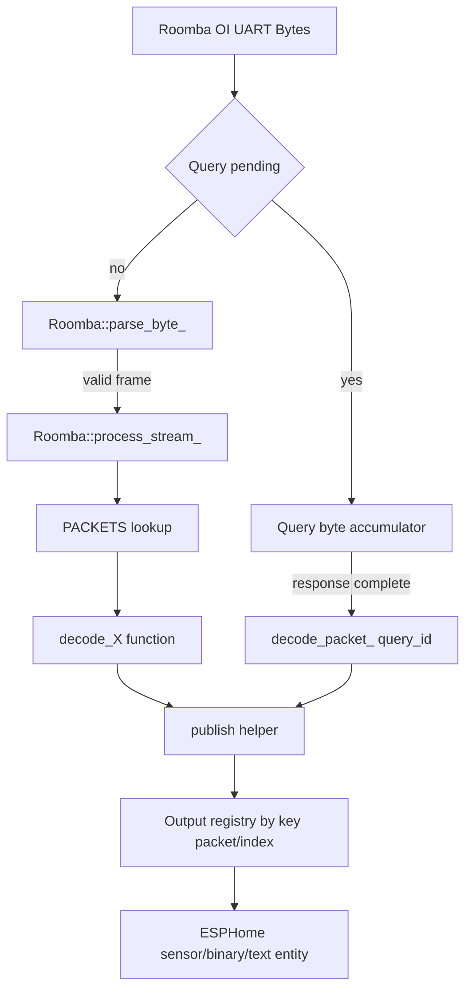

# Roomba Architecture

This document is the single source of truth for architecture and runtime behavior in this repository.

## Scope

This project provides an ESPHome external component that communicates with Roomba Open Interface (OI) over UART and exposes:

- Numeric sensors via `sensor` platform bindings
- Binary sensors via `binary_sensor` platform bindings
- Text sensors via `text_sensor` platform bindings

Related docs:

- `getting-started.md` for first-time setup
- `troubleshooting.md` for runtime/debug guidance
- `roadmap.md` for planned features and gaps

## Code Layout

### Runtime (C++)

- `components/roomba/roomba.h`
  - Main component API and state
  - Stream parser state machine definitions
  - Output registry and registration functions
- `components/roomba/roomba.cpp`
  - UART setup/loop lifecycle
  - Recovery flow and optional BRC pin handling
  - Stream parser implementation and packet dispatch
  - Command helpers (`start_clean`, `dock`, `stop`, `reset`, `set_day_time`)
- `components/roomba/protocol.h`
  - OI opcodes (`Opcode`)
  - Packet metadata table (`PACKETS`) with packet size and decoder callback
  - Text maps for charging state and OI mode
- `components/roomba/decode.cpp`
  - Packet decode functions and publish helpers
  - Type/unit conversions (for example mm to m, mV to V)

### ESPHome codegen (Python)

- `components/roomba/__init__.py`
  - Component config schema (`use_stream`, `auto_reconnect`, `restore_state`, optional `brc_pin`, optional `time_id`)
  - Adds compile-time `ROOMBA_MAX_OUTPUTS` define
  - Registers command automation actions (`start_clean`, `dock`, `stop`, `reset`, `set_day_time`)
- `components/roomba/sensor.py`
  - Sensor mapping and registration (`register_sensor`)
- `components/roomba/binary_sensor.py`
  - Binary mapping and registration (`register_binary`)
- `components/roomba/text_sensor.py`
  - Text mapping and registration (`register_text`)

## Runtime Architecture

## Layer 1: Transport

- UART bytes are consumed in `Roomba::loop()`
- `parse_byte_()` implements stream framing using states:
  - `WAIT_HEADER` (expects `0x13`)
  - `WAIT_LENGTH`
  - `READ_PAYLOAD`
  - `READ_CHECKSUM`
- Valid frames are passed to `process_stream_()`

## Layer 2: Protocol Dispatch

- `process_stream_()` walks payload packets in `[id][data...]` segments
- Packet size lookup uses `get_packet_size_()` against `PACKETS`
- `decode_packet_()` invokes the decoder callback from `PACKETS`

## Layer 3: Decode and Publish

- Decoder functions in `decode.cpp` parse packet bytes
- Decoders call `publish_u8`, `publish_s16`, `publish_bool`, or `publish_text`
- Publish helpers route values through key `(packet << 8) | index`
- Final destination is an `OutputSlot` holding one ESPHome entity pointer

## Layer 4: Entity Binding

- Python config maps entity names to `(packet, index)` pairs
- During codegen each configured entity is registered with the C++ component
- Registry storage is fixed-size `std::array` bounded by `ROOMBA_MAX_OUTPUTS`
- Runtime rebuilds a unique requested packet list from registered outputs
- Stream startup and query fallback both use this same dynamic packet list
- Decode dependencies are expanded during list build (for example packet `26` adds packet `25`)

## Data Flow

## Supported Configuration

Configured under the `roomba` component:

- `use_stream` (default `true`)
- `auto_reconnect` (default `true`)
- `restore_state` (default `false`)
- `brc_pin` (optional GPIO output pin)
- `time_id` (optional `time` component reference for Roomba clock sync)

## Recovery and Resilience

Recovery behavior in `loop()` is silence-based when `auto_reconnect` is enabled:

- After ~3s silence: call `recover_roomba_(false)`
- After ~7s silence: call `recover_roomba_(false)` again
- After ~15s silence: `hard_reset_()` (if BRC configured), then recover

`recover_roomba_()` currently does:

- Reset parser/query state
- Wake using BRC pulse when configured
- Send `START` three times, then `SAFE`
- Start stream when `use_stream` is enabled
- Optionally re-issue last cleaning command when `restore_state` is enabled and not boot

## Commands

Exposed command methods:

- `start_clean()` -> sends `Opcode::CLEAN`
- `dock()` -> sends `Opcode::SEEK_DOCK`
- `stop()` -> sends `Opcode::STOP`
- `reset()` -> sends `Opcode::RESET`
- `set_day_time()` -> sends `Opcode::SET_DAY_TIME` (`168`) with `[day][hour][minute]`

All opcodes are rate-limited by `send_opcode()` to avoid sending faster than 100 ms.
`set_day_time()` follows the same command spacing policy before writing its 4-byte sequence.

Clock sync behavior is split between component and YAML automation:

- Component side: when `time_id` is configured, `loop()` performs one initial sync as soon as time first becomes valid after boot.
- Automation side: users schedule recurring syncs (for example daily) by calling `roomba.set_day_time` from `time.on_time`.

Button-triggered command behavior is exposed via automation actions and can be attached to ESPHome `button` entities using `on_press`.

## Packet and Sensor Coverage

Stream startup packet IDs are dynamic and derived from configured entities. Query fallback (`use_stream: false`) uses the same dynamic list.

If no entities are configured, runtime falls back to requesting packet `7` (`BUMPS_WHEELDROPS`) to avoid an empty request list.

Current decoder table `PACKETS` includes additional IDs (43-58 subset). These are requested only when an enabled entity maps to those packet IDs.

Current YAML-exposed entities:

- Sensors: `distance`, `angle`, `battery`, `voltage`, `current`, `temperature`
- Binary sensors: `bump_right`, `bump_left`, `wheel_drop_right`, `wheel_drop_left`, `wall`, `cliff_left`, `cliff_front_left`, `cliff_front_right`, `cliff_right`
- Text sensors: `charging_state`, `oi_mode`

## Current Limitations

- Query mode fallback is implemented for one-packet `SENSORS` polling and now follows the same dynamic packet set used by stream mode
- `oi_mode` text sensor maps to packet `35` and is requested/decoded when enabled

## Extension Workflow

To add a new data point end-to-end:

1. Add/update packet metadata in `PACKETS` in `protocol.h`
2. Implement decoder logic in `decode.cpp`
3. Add mapping entry in one Python binding file
4. Ensure packet metadata is present in `PACKETS`; stream/query request selection is derived automatically from entity mappings
5. Update this document

## Maintaining Documentation

When runtime behavior changes, update all of the following in the same PR:

1. This architecture document
2. `sensors.md` mapping tables
3. `config.md` examples/options
4. `README.md` feature and example sections
